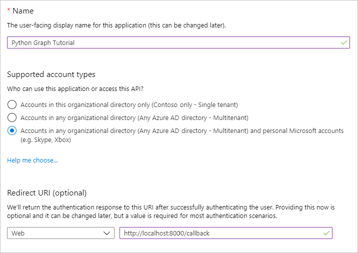
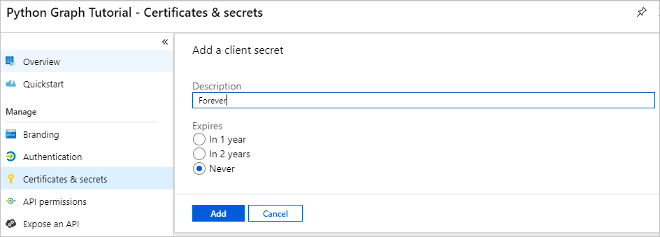

<!-- markdownlint-disable MD002 MD041 -->

在本练习中，你将使用 Azure Active Directory 管理中心创建新的 Azure AD web 应用程序注册。

1. 打开浏览器，并转到 [Azure Active Directory 管理中心](https://aad.portal.azure.com)。 使用**个人帐户**（亦称为“Microsoft 帐户”）或**工作或学校帐户**登录。

1. 选择左侧导航栏中的“**Azure Active Directory**”，再选择“**管理**”下的“**应用注册**”。

    

1. 选择“新注册”****。 在“注册应用”**** 页上，按如下方式设置值。

    - 将“名称”**** 设置为“`Python Graph Tutorial`”。
    - 将“受支持的帐户类型”**** 设置为“任何组织目录中的帐户和个人 Microsoft 帐户”****。
    - 在“重定向 URI”**** 下，将第一个下拉列表设置为“`Web`”，并将值设置为“`http://localhost:8000/callback`”。

    

1. 选择 "**注册**"。 在 " **Python Graph 教程**" 页上，复制**应用程序（客户端） ID**的值并保存它，下一步将需要它。

    

1. 选择“管理”**** 下的“证书和密码”****。 选择“新客户端密码”**** 按钮。 在 "**说明**" 中输入一个值，然后选择 "**过期**" 选项之一，然后选择 "**添加**"。

    

1. 离开此页前，先复制客户端密码值。 将在下一步中用到它。

    > [!IMPORTANT]
    > 此客户端密码不会再次显示，所以请务必现在就复制它。

    
