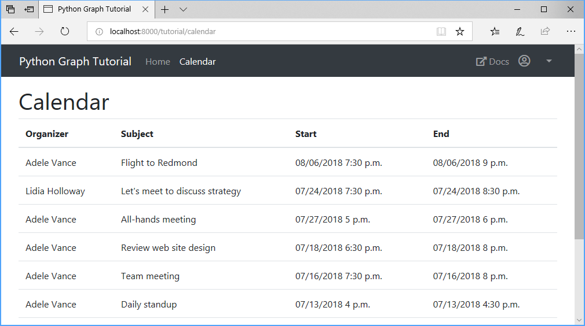

<!-- markdownlint-disable MD002 MD041 -->

在本练习中，将把 Microsoft Graph 合并到应用程序中。 对于此应用程序，您将使用[flask-oauthlib](https://requests-oauthlib.readthedocs.io/en/latest/)库对 Microsoft Graph 进行调用。

## <a name="get-calendar-events-from-outlook"></a>从 Outlook 获取日历事件

1. 首先，将方法添加到 **./tutorial/graph_helper py**以提取日历事件。 添加以下方法。

    :::code language="python" source="../demo/graph_tutorial/tutorial/graph_helper.py" id="GetCalendarSnippet":::

    考虑此代码执行的操作。

    - 将调用的 URL 为`/v1.0/me/events`。
    - `$select`参数将为每个事件返回的字段限制为仅显示视图实际使用的字段。
    - `$orderby`参数按其创建日期和时间对结果进行排序，最新项目最先开始。

1. 在 **/tutorial/views.py**中，将`from tutorial.graph_helper import get_user`行更改为以下代码行。

    ```python
    from tutorial.graph_helper import get_user, get_calendar_events
    ```

1. 将以下视图添加到 **/tutorial/views.py**。

    ```python
    def calendar(request):
      context = initialize_context(request)

      token = get_token(request)

      events = get_calendar_events(token)

      context['errors'] = [
        { 'message': 'Events', 'debug': format(events)}
      ]

      return render(request, 'tutorial/home.html', context)
    ```

1. 打开 **/tutorial/urls.py** ，并将现有`path`语句替换为`calendar`以下项。

    ```python
    path('calendar', views.calendar, name='calendar'),
    ```

1. 登录并单击导航栏中的 "**日历**" 链接。 如果一切正常，应在用户的日历上看到一个 JSON 转储的事件。

## <a name="display-the-results"></a>显示结果

现在，您可以添加一个模板，以对用户更友好的方式显示结果。

1. 在 **/tutorial/templates/tutorial**目录中创建一个名为`calendar.html`的新文件，并添加以下代码。

    :::code language="html" source="../demo/graph_tutorial/tutorial/templates/tutorial/calendar.html" id="CalendarSnippet":::

    这将遍历一组事件并为每个事件添加一个表行。

1. 将以下`import`语句添加到 **/tutorials/views.py**文件的顶部。

    ```python
    import dateutil.parser
    ```

1. 将/tutorial/views.py `calendar`中的 **./tutorial/views.py**视图替换为以下代码。

    :::code language="python" source="../demo/graph_tutorial/tutorial/views.py" id="CalendarViewSnippet":::

1. 刷新页面，应用现在应呈现一个事件表。

    
